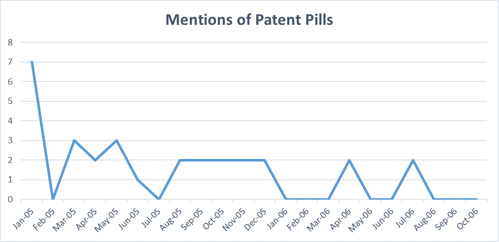
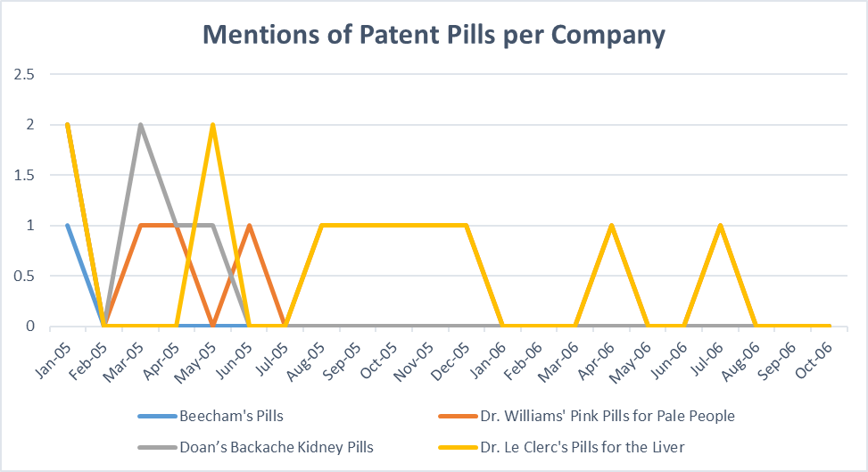
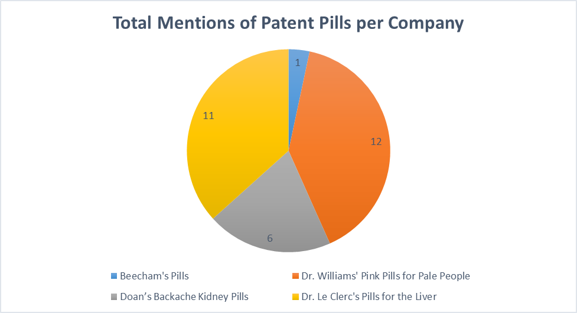
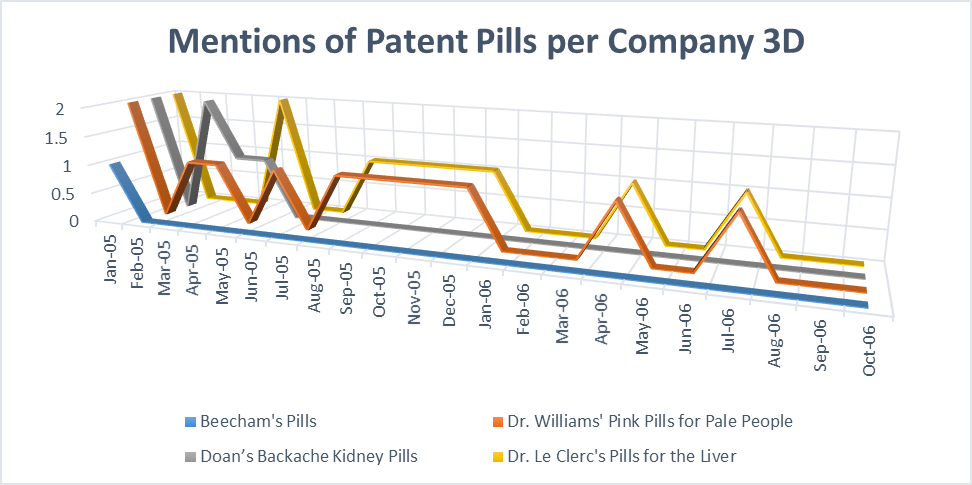

Even in our current society we see advertisements for products that do not always seem conventional. We might be walking through a store and see a product that is advertised to do great things for our health without using chemicals or anything unnatural. Some will advertise that they use natural herbs or minerals to get their results. This is not something unique to our time, they are actually the lasting remnants of patent pills from the past. These medicines have become less common because of efforts to regulate drugs, such as the first Pure Food and Drug Act in 1906 and the creation of the US Food and Drug Administration (FDA).  These actions made it illegal for these products to have misleading, fraudulent, overstated, or extravagant claims on their products without being able to back it up. The 1906 act just required these products to at least label what ingredients they were using and to accurately state what the medicines were doing but in 1936 the statute was revised. This revision banned all products that had misleading claims and caused these companies to overhaul their products with different ingredients, claims, or purposes in order to follow the law. Products like Coca-Cola, 7-up, Dr Pepper, Vicks Vaporub, and many more are current consumer products that evolved from patent medicines of the past.

Patent Medicines, otherwise known as Nostrums, are medicines that are not considered effective because they are prepared by an unqualified person or company. They are usually highly advertised with creative claims in order to reel in customers. In the *Egyptian Gazette*, these advertisements were sometimes disguised as stories which then ended up turning into advertisements after catching readers’ attentions. The Picnic Girl is one of the many examples of clever advertising that patent medicines used in newspapers in order to slyly promote and sell their product.

In the *Egyptian Gazette*, there are many different occurrences of patent pill advertisements and this analysis will analyze the frequency of these advertisements throughout the publication, compare results of these occurrences to see which patent pills were the most successful, and lastly evaluate their longevity to see if it is positively correlated by their advertising frequency.

It seems that the total number of advertisements of patent medicines in the *Egyptian Gazette* declined as the year passed.  The peaks occurred in January, March, and May of 1905 while the strongest dips were in February of both years, July of 1905, and a few other months in 1906. There seems to be a trend of slow decline throughout the two years but the month of February seems particularly odd since it is such a huge drop compared to the two months around it. According to the trend, February should have had around 5 total advertisements but instead it had none. The total then jumped back up to 3 in the immediately following month. The month of February in 1905 has a substantial amount of submissions (around 18) so a lack of postings does not seem to be the issue.

After splitting up the patent pill mentions by company there are some obvious signs of market dominance. Dr. Williams' Pink Pills for Pale People and Dr. Le Clerc's Pills for the Liver each both had around double of the mentions as the other companies combined (12 and 11 to 6 and 1). However, Doan’s Backache Kidney Pills was also dominant in the first few months and had as many mentions as the other top two medicines until the summer months of 1905 occurred. After this slump the company had no mentions for the rest of the two years.

I researched Doan’s Backache Kidney Pills and was surprised to notice that, despite their disappearance from the newspaper, they are still running strong. (Although with some branding and claim changes). I also researched Beecham’s pills because I was curious if the amount of advertisements a product had correlated with the product’s/company’s longevity. Beecham’s pills had the least mentions out of the 4 patent medicines in the newspaper, with only one article. However, their company transformed into the Beecham Group which was still running until 1989 when it then merged with another company (BBC). This long lifespan shows that longevity of the company and frequency of their product advertisements were not directly correlated.

Towards the end of the analysis time period, Dr. William’s and Dr. Le Clerc’s pills seemed to both follow an identical pattern. Upon shifting the graph into a 3D version you can see that starting from August of 1905 the two companies had identical advertisement frequencies while the other two products seemed to flatline.

The two products had the same advertisement frequency from August of 1905 to the end of the analysis in October of 1906. This strikes me as odd and leads me to believe that these patterns might be caused because of submission errors. Shifting the graph to a 3D version also helped emphasize how rarely Beecham’s Pills were advertised compared to the other 3 products. This shift also helps highlight the market dominance that Dr. Williams' Pink Pills for Pale People and Dr. Le Clerc's Pills for the Liver had throughout both years. Coming back to the analysis of company success in relation to advertisement frequency I was surprised to see that Dr. Le Clerc's Pills for the Liver did not seem to have lasted long after this time period, despite the large amount of advertisements the company had in the *Egyptian Gazette*. I could not find any recent information on this product or the company that advertised this product which was odd because even the Beecham product had information despite its lack of advertisement. However, the other market dominator, Dr. Williams' Pink Pills for Pale People, did seem to last much longer than its competitor.

Dr. Williams' Pink Pills for Pale People was a product of G. T. Fulford & Company, and was sold under the company name of Dr. Williams Medicine Company (Bator). Fulford grew this product and at one time had over 1 million dollars in its advertising budget (Bator). The entire Fulford family became extremely wealthy from this product and Barton emphasized how widespread the product was and how wealthy it made the Fulford family in his article,

> The lucrativeness of Pink Pills can only be estimated from the value of Fulford’s empire when he died, which was almost five million dollars. In the early 20th century the pills sold for 50¢ a box or six boxes for $2.50. Tunnell placed the annual consumption in Canada alone at one million boxes, producing, conservatively, more than $160,000 in profits. The high volume of Fulford’s sales demonstrated the fact that patent medicines were big business. The market for Pink Pills extended beyond Canada and North America. By 1905 G. T. Fulford and Company had established branches in Schenectady, N.Y., London, Paris, Sydney, Wellington, Singapore, Bombay, Rio de Janeiro, Buenos Aires, and Cape Town. Branches were later established in China and Hong Kong.

The meteoric rise of patent medicines in the late 1800s and early 1900s is an interesting occurrence which left many people with huge sums of money and really set the foundation for clever advertising techniques which can still be seen in today’s marketing styles. Although many people were misled about these products and their uses, they were an interesting example of what the new era of media and production/machinery capabilities could bring to the table, and how lucrative this type of advertising-based industry could be.
 
# Works Cited
- BBC, "[BUSINESS Profile: SmithKline Beecham](http://news.bbc.co.uk/2/hi/business/606830.stm)." BBC News. BBC, 18 Dec. 2000. Web. 24 Apr. 2017.
- Bator, Paul Adolphus. "[Biography – FULFORD, GEORGE TAYLOR](http://www.biographi.ca/en/bio/fulford_george_taylor_13E.html)." *Dictionary of Canadian Biography* Volume XIII (1901-1910). University of Toronto/Université Laval, 1994. Web. 24 Apr. 2017.
