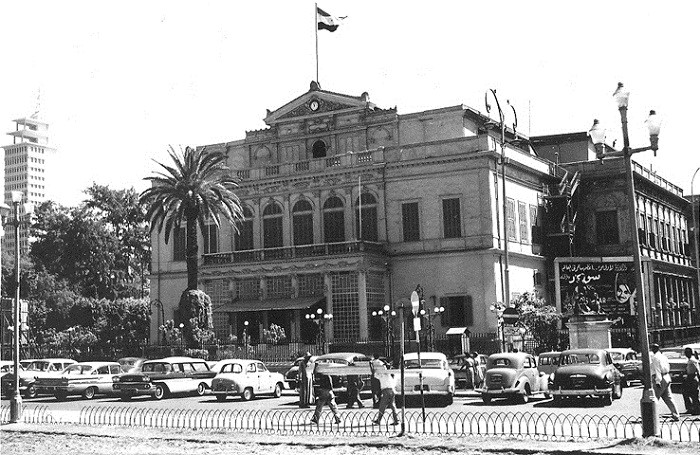
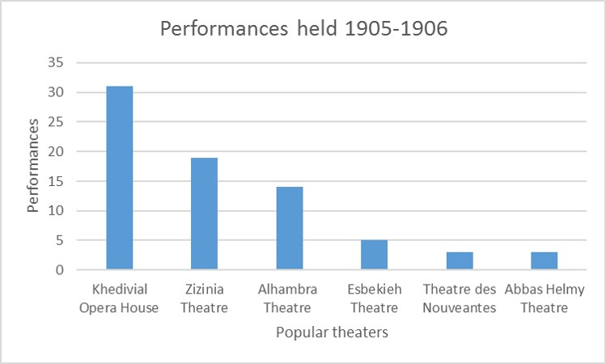

# Intro and Question

While trying to find a topic for my blogpost, I repeatedly ran into road blocks. Should I do my blog on those random numbers at the bottom of every ad? No, I told myself, that seems too complicated. Maybe I could blog about my OCR troubles? But then again, that seems to basic. As I scoured the Gazette, and my brain, for ideas, a quirky name caught my eye. Madame Butterfly. As I looked a little into Madame Butterfly, I found out that it had been an incredibly popular play during the period and was presently making the rounds across Egypt. After doing my blog on it, I realized that Egypt certainly had other plays and concerts occurring throughout its various theatres. Putting two and two together, I started thinking that I could ultimately do my analysis project on the most popular theater in Egypt at the time. The Khedivial Opera House.

# Finding the Most Popular Theatre

Just figuring out what theaters existed and were prominent at the time was its own journey. There were not any charts, that I could find, with a list of theaters in Egypt, so I used a series of questions to figure out theaters that may exist. I first searched for paragraphs containing Madame Butterfly and found a theater called Khedivial Opera House. Afterward, I tried searching for theaters, but theater was only used as a general statement rather than being part of a theater name. Instead, theatre was used in theater names, so I looked for that word instead. This gave me some problems because theatre could describe a travelling band of performers, such as the Verdi Theatre, or it could refer to an opera house or theater such as the Alhambra Theatre. I was unsure of what words I could query out to discern between travelling company and theater, so I ended up going into the articles and separating the two myself.

Learning the ins and outs of XPath querying was brutal, and it was only made worse due to various misspellings of the opera houses. I initially tried to account for these misspellings by searching for them as well, but since each had at least one misspelling, I gave up trying to include these because of the variability. I ran into several issues when researching the amount of performances in the Zizinia Theatre that was unrelated to spelling. For some reason, Zizinia, a relatively popular theater, was achieving astronomical his. Due to background research, I knew that the Khedivial Opera House was the most popular theater before it was tragically burned down in 1971, but Zizinia was achieving 152 hits compared to the Khedivial’s 60. I had been using a simple query that only searched up how many times the theater was mentioned in the Gazette `//p[contains(.,‘Insert name’)]`. I figured that the most popular theater would be the one most talked about in the Gazette; however, the Zizinia Theatre was named within the template for the “Magasins Victoria” ad. Sadly, many people copy and pasted this ad as is, or the ad never needed any changing to begin with. Either way, this ad really bolstered the amount of times the Zizinia Theatre popped up. To circumvent this, I created two queries. One said `//p[contains(.,‘insert theater name’)][contains(.,‘company’)]` while the other query said `//p[contains(.,‘insert theater name’)][contains(.,‘performance’)]`. I used company and performance because those were words constantly being used when an event was occurring in a theater. This brought Zizinia down to a more reasonable 19 and left the Khedivial Opera House in its rightful spot.

# The Khedivial Opera House

The Khedivial Opera House, alternatively known as the Royal Opera House, was a center for travelling companies from across the world. One of the most prominent of these companies was the Verdi Theatre of Italy. Part of the reason for this relates to Giuseppe Verdi, the founder of the theater, who performed the inaugural opera for the theater back in 1869. Rigoletto, one of his many masterpieces, had been the inaugural performance and it had eight new renditions from various traveling companies between 1905 and 1906. The Egyptian crowd considered it a classic and loved it every time it was performed, but none did it as grand as the Verdi Theatre company. The influence of Italians on the Khedivial Opera House doesn’t end there though. The theater was “constructed in only six months to the design of two Italian architects, Avoscani and Rossi” (The Khedivial (Royal) Opera House in Egypt) and commissioned by then Khedive Ismail. Khedive Ismail originally wanted the inaugural opera to be a grand tale about Ancient Egypt and national pride, but Rigoletto was played since the opera was not finished. He hired Verdi, a magnificent musician, Mariette Pasha, a phenomenal playwright, and Gialanzoni, a prodigious poet, to create the masterpiece ultimately known as Aida which played in 1871, two years after the opening (The Khedivial (Royal) Opera House in Egypt).

The opera house had been the “first in Africa, where famous world Opera and symphonic masterpieces were performed”, but on “28th 1971, the great Royal Opera House was tragically burned down” (The Khedivial (Royal) Opera House in Egypt). The wooden structure was destroyed. The Cairo Opera House ultimately succeeded it in 1988.

# Looking at the Tools

When it comes to the tools used throughout this semester, I found them all helpful and easy to get used to. I had a bare bones idea of programming beforehand, and I was concurrently taking Programming 1 with this class; however, I found learning Oxygen XML to be easy regardless of prior coding experience. The only tool I ever really had problems with was the OCR tool. I use a Windows PC, so my only OCR choice was the AABBY Fine Reader, and reading in my images of the newspaper was constantly a hassle. It was worse in the beginning of the year because my image files were not the clearest, but even now I still find OCRing to take at least an hour because of all the misspellings that I need to correct before moving. Ultimately, I feel as if my struggles may have to deal with the quality of my images still, but I consistently strive to take better pictures when I go to Strozier. I never ended up stitching my files together because the complete stitch always had overlapping pages, so I would just OCR one part of a page at a time.

# Conclusion

Even though this class gives you a free A, you must work your butt of to get it. Though the class isn’t hard, it has a special place in my heart as the most time-consuming course I have, and, hopefully, will ever take in college. After it started being a newspaper edition due a week, I could not turn any deliverable in on time, and I would end up spending a couple hours just to get one page done. And researching my analysis question? I had no idea trying to query could be so time consuming. I spent an hour just trying to figure what theaters existed in the Gazette, and doing everything taught me something. Respect for people doing digital microhistory. Taking relatively small sections of people’s lives and relating them to an overarching narrative is some serious hard work. On the bright side though, I learned a lot about the Egyptian people during this time, and they love their theaters. Operas and plays consistently drew in large crowds from across Egypt, and, in the case of the Khedivial Opera House, all around the world.

# Bibliography
- "The Khedivial (Royal) Opera House in Egypt." Cairo Opera House. N.p., n.d. Web. 17 Apr. 2017.
- "Cairo's first opera house remembered." Ahram Online. N.p., n.d. Web. 17 Apr. 2017.
