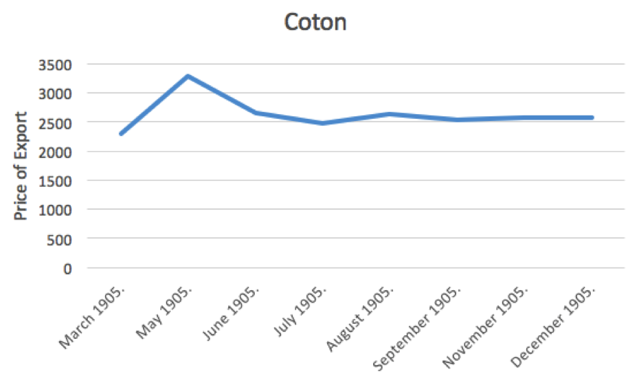
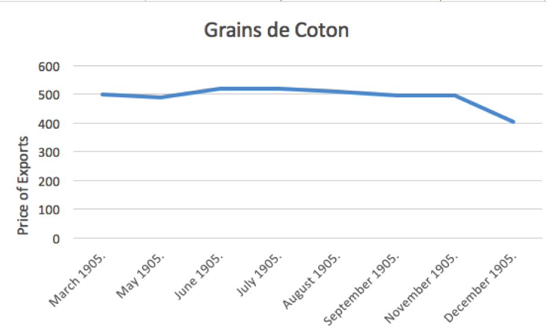
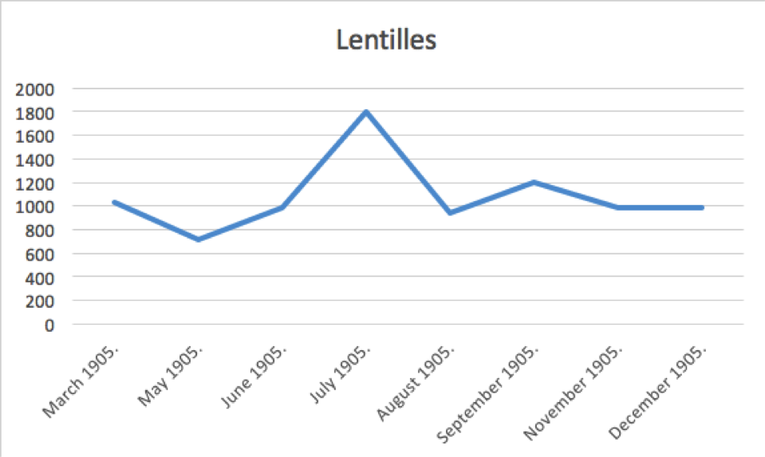
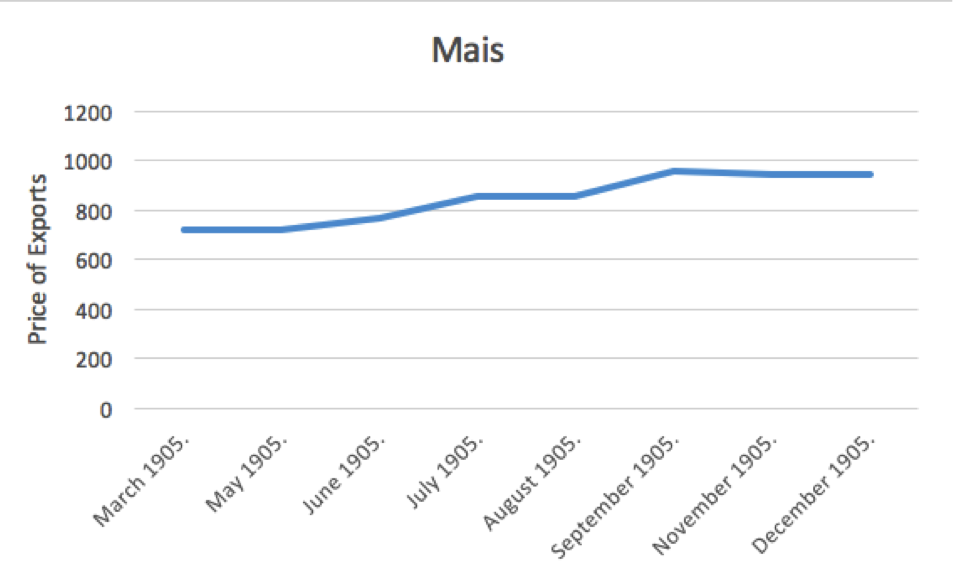
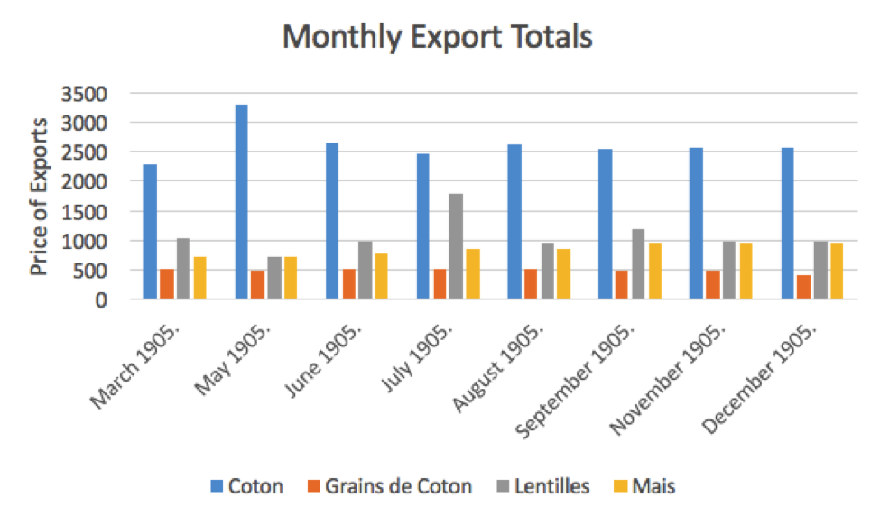

The XPath query targeting the [Tarif d’Exportation](https://dig-eg-gaz.github.io/templates/#tarif-dexportation) table, `//div[@xml:id="deg-el-tdex01"]` only came back with 11 items--should have returned about 20. The table comes out once a month, and there is about a year and a half of the newspaper encoded. There was a result in March, July, 6 results in August, and 3 in September, all in 1905. The table of the prices of exports is released once every month, so in the encoded sections by other students, four months were found.

One of the problems collected from the first XPath query done was that some of the data from the newspapers was not entered into XML correctly. For example, in the online template for July, 1906, the export tariff of coton was 2475, grains de coton was 520, lentilles was 1800, and mais was 855. Some of the students (such as during the months of September and July 1905) did not enter in the correct data from the date of their paper. This error makes it difficult to examine the data because it is not correct from the months of the paper that the table was a part of.

Next, in order to attempt to find more data from the table Tarifs D’Exportation, I used a general find search, non case-sensitive, in order to attempt to find more tables that were not entered in correctly but contain the data I’m looking for about the tariffs. I search for “tarifs d’exportation.” This search found 13 results in the xml documents. I found a new result from May 1905, that was the correct table with the information I need. There were also two results from August and two from September, three from November that contained inaccurate tables that were empty or missing. However, one of the November and a December results contained the table that was accurate and useful.

So, using the data in oxygen with other students’ data yielded some results, but not all of the months that I need. I tried other, broader searches in Oxygen in order to try to find more of the tables that may have not been correctly encoded when the person entered them in. I first tried to search for “exportation,” but the document yielded 570. I next tried to search for “tariff,” but it yielded 957 results.

After trying many different searches, I decided to analyze the data that I found from 1905 only, because for some reason in the searches, no results from 1906 showed up in the data.

In the data, I noticed that two months, July and September 1905, contained the same results and the same table and numbers. I then looked at the Tarif d’Exportation template on the website, and noticed that the results in the July and some of the September issues were the same as the template, so the person did not enter the table in correctly. However, one of the results in the July issue was correct and did match the page files that I found in Github. I next found that the tables that were found in September 13,14 and 15 of 1905. Then, using the incorrect tables, I noted which pages they were on in which issues, and then I looked up in the page image files and found the correct values for the tables. I entered the results into an Excel document and first I created a table of the data:

Then, using the table I created graphs for each of the different exports in order to attempt to find a trend line in the data to analyze the price of exports on each item. The first thing that I noticed when I created the trendlines for each export item was that all of different items consisted of very differently shaped trendlines with spikes in the prices at different times. For this reason, the data that I collected did not convey a certain theme within it, such as all the prices dropping or raising at the same time, because the different items peaked and decreased at different times throughout the year of 1905.

For example, the tarif of exportation of cotton peaked at a high of 3295 in May of 1905, then remained steady the rest of the year at around 2500.

The Grains de Coton was the trend line that differed the least throughout the year of 1905. It remained pretty steady around 500 until December when, what looks like a steep drop on the chart, to 400.

The graph of Lentilles (beans) went up and down a lot, with the main peak of the trend line occurring in July 1905, when it jumps up about 800 from the previous months. The graph then begins to level out at the end of the year.

The general trend of the mais (corn) crop was generally upwards throughout the year of 1905. There were no steep trends in the months as the progress/increase in the price of the tarif increased slowly from close to 800 to only about a little below 1000.

In terms of analyzing the data found from 1905, with the price of export tariffs of cotton, cotton grains, beans, and corn, the data did not clearly indicate peaks within a certain point of time that were all consistent with each other. In contrast, the prices went up and down without correlating with each other, or even with the general economic trends during the times of 1905. According to _The Board of Trade Journal_, the general exports from Egypt to France decreased from 1904 to 1905. If more of the newspaper was encoded correctly, or encoded at all, it would be possible to compare different years to the general trends of the tariffs, instead of comparing the different months to each other. Also, the currency that was used in 1905, is in some ways similar to the currency found in modern day Egypt. In 1834, the Egyptian pound was introduced to replace the previous currency, the Egyptian piastre. The Egyptian pound was issued based on gold and silver. The methods of trading in 1885 required exchange rates to be formed with Europe using standard bar gold rates, and the Egyptian pound was then first compared to the British pound sterling.

Next, the total amounts of all of the exports can also be graphed, in order to see which of the 4 items was the most to export in the year of 1905.

The bar graph is consistent in which item costs the most to export by a lot. Coton always costs the most to export by a considerable amount, it is usually 2-3 times more money to export than any of the other 3 items. Coton costs the most to export most likely because it was in high demand during this time period, and it was the most popular item. The other three items are pretty close in prices, especially the lentilles (beans) and mais (corn), as they are usually have the same export price, while the grains de coton have the lowest price of export.
