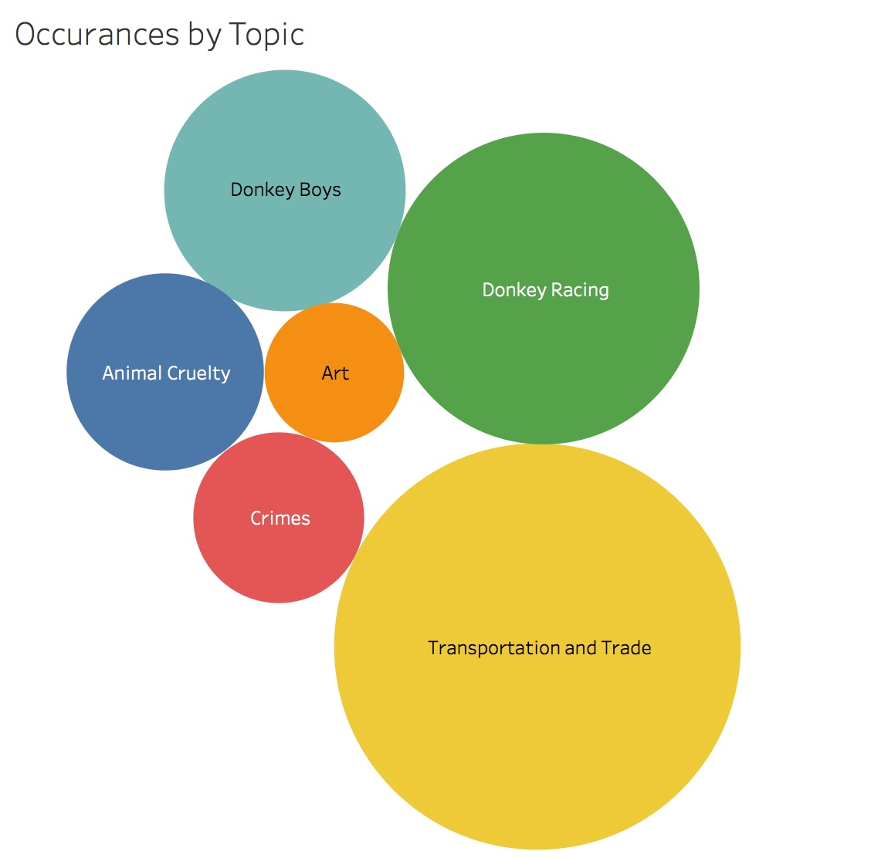
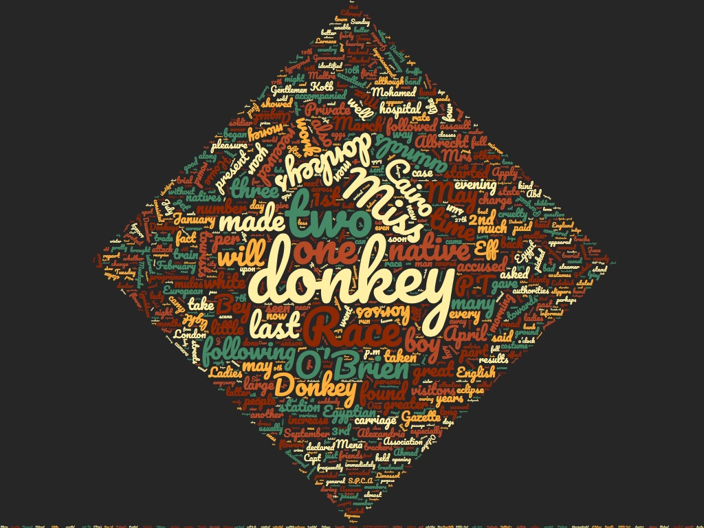
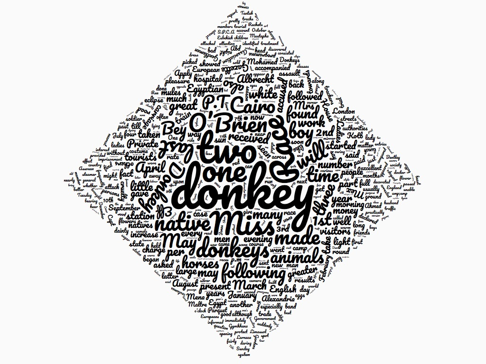

## Brewing the Idea
I began upon this subject for my analysis project through my [blog post](https://dig-eg-gaz.github.io/curiosities/Barrett-Donkey-Drivers/) that I wrote earlier in the class. I found a peculiar article in my week of March 1905 entitled “A Cairo Nuisance”. It was all about “donkey-boys” and how they harass residents of Cairo. Today, one would be hard-pressed to find someone in America who regularly sees donkeys, much less is harassed by their owners, so this subject interested me. The closet thing I could think of was people at the mall who stand at the kiosks and politely verbally accost you until you try their perfume samples. As the article indicates, there are already cabs in Cairo, so are the donkeys a fading form of transportation? Are they pets? What type of person owns them? The “Cairo Complainer” (a name I have given the anonymous Cairo resident who wrote the original article) seems to be of a status that is above donkeys. With so many questions, I was curious about their role in 1905/1906 Egypt, and wanted answers.
This course focuses around micro history, which is using small facts and details found in primary sources and weaving them into a larger, big-picture look at history. In any history class, no professor spends a lecture on donkeys. At the same time, there were clearly donkeys in Egypt at the time; they were a part of the lives of the residents in Egypt. Despite their seemingly unremarkable role, they had a role nonetheless. Therefore, I found this subject to be perfect for a serial micro history investigation.

## Serial Question
I realized that although my original article focused on the “donkey-boys”, it would be more fruitful to be slightly less specific and broaden my topic to be on the subject of donkeys in general. My goal is to learn exactly how donkeys were used and perceived by those living in Egypt at the time. It is unrealistic to think that every perspective of donkeys is present in the *Egyptian Gazette*, especially given the audience is French and English people living in the area at the time.  so I arrived at the serial question “What is the role of donkeys in 1905/1906 Egypt as represented by the *Egyptian Gazette*?”.

## XPATH Query
To practically answer this question, I needed to create an XML search query. This allows me to search all the issues of the newspaper that have been uploaded to our content repository on Github, effectively searching through every daily issue of the *Egyptian Gazette* from 1905 and 1906 that has been completed. An XML search basically needs two things... a WHERE, and a WHAT.

###  What?
My “what” was easy... donkeys. I knew that I need to try to find every reference to donkeys that I could. I realized that there is more than one word for donkey, but after some preliminary searching, I saw that the most common substitute turned up primarily the word “association”. It seemed like donkey was the term of the land for the creature.

### Where?
As discussed before, I needed to find every mention of donkeys that I could. I might find these mentions on page 2, 3, 4, anywhere. However, I knew that I wouldn’t find the references in a specific advertisement or table as many of my classmates would. Therefore, I made my search a general search for the word “donkey”.
`//p[contains(.,"donkey")]`

However, XML searches are case sensitive. I still had one more search to do.
`//p[contains(.,”Donkey")]`

I collected my results for the first query on Friday April 21st at 4:28 p.m. and the second query at 5:35 p.m. on Friday, April 21st. Then, I organized them by topic and formulated the results section of this paper.

## Challenges
Not all of the articles were corrected perfectly from the OCR software, so I had to do some decoding to figure out what they were saying. Keeping this in mind, there could be other mentions of donkeys that I was not able to discover because someone failed to correct a misreading by their OCR software. Occasionally, I would come across a section that was improperly divided, or missing appropriate sections. For example, despite the word “donkey” being mentioned only once, I received a several different articles as results and had to sift through them to find the content I was searching for.  In addition, on May 11th, 1906 and May 9th, 1906, the same articles were featured. I’m not sure if this is intentional, a mistake of the Gazette, or a mistake of a fellow transcriber.

## Results
From the XPATH query, I found 41 mentions of the word “donkey”. In addition, I found 21 occurrences of the word with its first letter capitalized. Every article and the date can be found in the appendix of this paper. There are not 41 entries in the appendix because sometime the word appeared more than once in an article that was a continuation of the same topic. As discussed in a previous section, I organized them by subject. There were a handful of articles that did not fit into any of the categories, such as the one-off use of the phrase “Donkey Tail Principle”, and in a mention of horse shows. Below is a visualization of the different topics I organized the articles into. The bigger the circle, the more articles were in that category. More detail on the topics follows the visual.

### Donkey Racing - 10 occurrences
Donkey Racing mentions occurred at any time of the year. There were some in January, February, April, May, June August, and December. Therefore, donkey racing does not seem to be a seasonal sport. Many of the articles included who won which race, what times the races would occur, and information along those same lines. On August 16th, 1906 donkey races are described as “modest”. There was a variations of donkey racing that I found interesting. On June 1st, 1905. This article mentions that one of the sports they performed were Tug-of-War on donkeys!

### Donkey Boys- 6 occurrences
Piecing together the persona of donkey boys has been surprising. Their appearance must have been distinct because on March 12th, 1906, Mr. Firth was reported as dressing as one for a costume party. It was also reported that a man named Mohamed Dodo owns 60 donkeys and donkey boys. That means that these people are likely viewed as (at least) second class citizens due to the fact that they can be owned.

Although the original article I found negatively portrayed the donkey boys, I found two separate events that praise donkey boys for their action. On May 24th, 1905, a group of people had stones being thrown at them, but the donkey boys were not among those throwing the stones. Also, in July of 1905, there was a man who was beaten by someone, and the donkey boys were eyewitnesses and testified as to who the abuser was. The praise may stem from them typically being considered nuisances, but I think that with this little information, it is unfair to make that broad assumption.

### Animal Cruelty- 4 occurrences
There seems to be a vocalized care for the treatment of animals throughout the paper, which includes care for donkeys. The SPCA (Society for the Prevention of Cruelty to Animals) made strides for the protection of donkeys. In March of 1905, they declared that no longer would the same yolks that are meant for Buffalos be allowed on donkeys. That September, 82 donkeys were treated by at the animal hospital. From January 10th-April 24th, 301 donkeys were treated.

### Crimes- 3 occurrences
Two occurrences focused on their donkeys being stolen, which means that donkeys were valuable enough for someone to care that they were missing. In August of 1906, a man was arrested for murdering his servant because his servant lost his donkey’s stirrups.

### Transportation and trade:-17 occurrences
It was common for reporting to be done on people traveling by donkey. Even the Khedival family traveled by donkey (February 1st, 1905). They were used not only to transport people, but also for trade purposes. The donkeys were traded, and things they transported were traded too, such as wood and other heavy things. They’re mentioned as being a part of street clutter on September 5th 1906. As of September 1st of 1905, it was mentioned that “despite trains”, donkeys were still the preferred method of transportation. However, an article from May 19th, 1906 states that the train was replacing the donkey as a form of transportation.

### In Art- 2 occurrences
Donkeys were featured on art, mentioned February,1905. There was a play called “Darktown Donkey Race” put on by people in Alexandria. I believe it to be a musical because there was another article about how a band played a song from the production.

In sum, donkeys seem to be a common, but fading part of the transportation/trade portion of people’s lives in Egypt in 1905/1906, as represented by the *Egyptian Gazette*. When donkeys weren’t used for trading, they were frequently used for racing. Although donkey boys may not have been held to the highest opinion, the SPCA still cared about the wellbeing of donkeys.

## Visualization
For the visualization of this data, I created a word cloud of all of the appearing in the same articles as the word donkey. I chose to do this because the words that most frequently occur with the word donkey should be an indication of what things were associated with donkeys, giving insight as to how they were perceived in early 20th century Egypt. Here is a word cloud of all of the words occurring in the same paragraphs. The bigger the word, the more often it occurred.

Although this looks nice, I have also developed a black and white version of the cloud. I did this because some colors stand out more. For example, it's easier to read the lighter ones than the darker ones. That should remove bias of some words seeming more important than others because of color and not because of size.

The sizes of many of the words make sense! For example, "Race" is large. Racing was a popular topic as shown by the circular visualization. "Boy" is another popular word, and my explanation is the same that of "Racing" being represented so boldly. Many of the months are featured in large print on the graphic. This is because I included all the dates of the articles in the document that I uploaded to create the word cloud. It does appear that the highest number of the articles occurred in May, which is reflected in visualization. I'd like to note that Cairo was much larger than Alexandria. This may be attributed to their geographical location, given that Cairo was an inland city (unlike Alexandria), and more transportation/traveling would need to be done on land than by sea. Some interesting things that I found based on the visualizations were the size of the words O'Brien, Miss (especially compared to the size of Mrs. and Ms)

- **O'Brien** - Private O'Brien was the last name of the man who was attacked, that the donkeyboys testified for him in courts. There was a follow up of the trial. They simply used his name a lot when telling the whole story, so that is why his name appears to large in the infographic.
- **Miss** - There were two misses involved in a donkey race, and a long list of misses who attended a costume party. The party was the same one at which Mr. Firth dressed up as a donkey boy. It was strange, because there seemed to be many "Mr."s but that didn't seem highlighted as largely in the word cloud.
- **Following** - The newspaper used the word "following" to precede any sort of list. It wasn't that people with donkeys were following others, or there was a large fan club following donkeys, just a different, unrelated use of the word.
- **Accused** - accused was also used a lot because of the incident with O'Brien. Beyond that story, it was used very infrequently.
