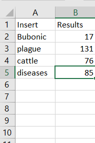
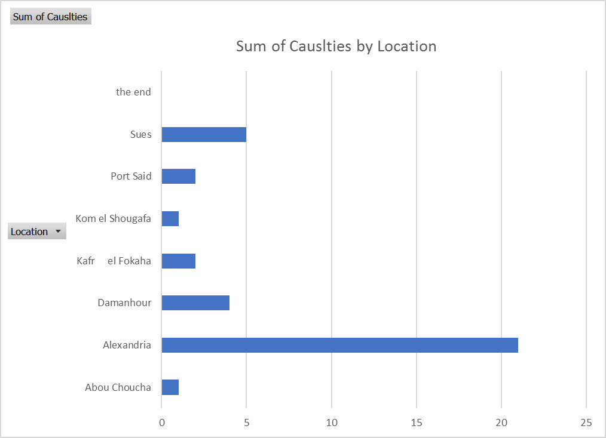

The _Egyptian Gazette_ is one of the most remarkable newspaper developed in Egypt that has informed and entertained the community for centuries. The newspaper was the main source of information for members of the community, as it was filled with short stories, financial tables, advertisements, and records of sports. In order to find material for my research, I used `//div[@type="item"][contains(., 'insertword')]` as my search query. As shown in the table below, I ran results for search words including Bubonic, plague, cattle, and diseases. The results for plague were high- 131 items- as to Bubonic-17.

In order to improve the quality of my research, I decided to specifically target the Bubonic Plague.
As death caused by plagues were repeatedly mentioned in my assigned week, the topic appeared numerous time through my classmates’ XML document.

The table below depicts how the result of deaths caused by the Bubonic Plague changes drastically in different cities. Cities that were affected by the plague include: Alexandria, Port Said, Sues, Zifta, and Damanhur. Because of the difference in casualties between the cities, I decided to investigate what may have been the underlaying promotion of the Bubonic Plague in the affected cities. By combining my curiosity for the Bubonic Plague and the sanity conditions of affected cities, my serial question developed into *“How the sanitary conditions of the cities may have promoted the Bubonic plague in different cities.”*

As I began my research, I had to set the foundation of my project by adapting my Oxygen XML editor to the standard XPath and XQuery language. Fortunately, Mr. Reddick(the teacher assistant), was kind enough to help students, such as myself, who are not familiar with the process. After the software was ready, I was able to search a number of XPath query with different terms. However, the process included a series of trial and error. For instance, I noticed that the query, `//div[@type="section"]/div/p[contains(., 'bubonic ')]`, resulted with only one item, while the query, `//div[@type="item"][contains(., 'bubonic')]` resulted with sixteen items. Because of the successful results, I ultimately remain using this template as my Xpath query, `//div[@type="item"][contains(., 'insertword')]`.  In order to find quality information regarding of the Bubonic Plague, the main search query used was `//div[@type="item"][contains(., ' Bubonic ')]`.

A barrier I encountered was that there were short articles appear in the results or the article regarding about a plague was hidden among other articles.Compared to recurring data in the newspaper, the death counts from the Bubonic Plague were written in articles rather than recorded in tables. As a researcher, it was frustrating not having a tool that would allow me to quickly input data in the Atom software or Windows Excel. However, it would be morally wrong to simply remember the victims of the Bubonic Plague as data; for that reason, the victims were mentioned in articles to remember them as an individual rather than as simple numbers. Shown below is a graph from the collection of data from the beginning of January 1905 to the end of April 1906.

As shown above, the city that was heavy affected by the Bubonic Plague was Alexandria, followed by Sues. The data contrasted my original presumption (Alexandria would be least affected by the plague), since it was a very attracted city to tourists. However, I realized how my assumption does not considered actual factors of the city’s condition. If a city or town is widely known it attracts numerous individuals, then the population will drastically increase since citizens will move to seek jobs. If a town is unknown and does not attract many business, then the population will be significant low compared to a city’s. As citizens of Egypt flock to  Alexandria, many would live in uncomfortable and unsanitary conditions since place was limited and many cannot afford a standard household. Since Alexandria had a large population, it was difficult to enforce sanitary laws. As individuals disregard sanitary laws to minimize diseases, the Bubonic Plague may have easily infected citizens since many individuals worked in close proximities and the disease could have easily been transmitted. However, the table below will depict how by the end of October, the Bubonic Plague was essentially gone. Since this became the case, I developed a new search query in order to answer how the government was able to control the plague and cure the victims.

In order to find valid information regarding how the disregard of sanitary conditions promoted the Bubonic Plague and how the Sanitary Department helped eliminate the Bubonic Plague , I search a query as `//div[@type="item"][contains(., ' Sanitary ')]`. Unfortunately, 271 items appeared as my result. To find information that specify targeted the Sanitary Department, I had to use a specific word choice. The search query that give me a substantial amount of result( 14 items) was, `//div[@type="item"][contains(., ' Sanitary Administration ')]`. As I read article by article, I came across a statement from January 1st, 1905 that states:

>During the week ending the 31st December, 15 cases of bubonic plague occurred throughout Egypt. An increase appears in the number of cases occurring at Suez last week. It appears from the report that I have received from Dr. Cresswell and from my own observations, (says Sir H. Pinching in his report) that these cases are due to infection conveyed by rata, which had been infected themselves by goods coming from India or Upper Egypt. One of the persons attacked by plague at Suez is an assistant in a shop, which contains large quantities of indigo coming from Calcutta and tea from Madras. In moving the cases containing these goods the dead bodies of rats were found.”

This statement released by an unknown writer depicts how easy it was to receive this infection in a heavily populated area. Since food and goods were being imported in contagious settings due to the lack of regulations, many bacteria developed on the products that consumers would eat or touch. As workers dealt with contaminated items on a daily basis, their family, neighbors, and coworkers were being exposed to the deadly Bubonic Plague.

On August 30th, the writer of the “Local and General” statements, stated: “The Sanitary Administration has demanded a new credit of  L.E. 10,000 for measures against the plague.” As the deaths caused by the Bubonic Plague were decreasing, the Sanitary Department was demanding a certain number of Egyptian pounds (L.E) to finally eliminate the plague. My theory for the demand is that the department may have been developing a vaccine. The only reason that the statement seems suspicious is because no information regarding as to how the Sanitary Department planned on managing the money was released. Even though I do not question the department’s intentions for the money, the public should have been informed on how the Sanitary Department was planning to eliminate the Bubonic Plague.

Articles and Statements released in the Egyptian Gazette reflect how unpredictable the Bubonic Plague was from 1905 to 1906.

> “Egypt is now free from bubonic plague, and the bulletin issued by the Sanitary department states that no case was reported during last week. Three cases, however, remained under treatment after the issue of the previous bulletin, but of these two have recovered, and one has ended fatally. All these three cases occurred at Alexandria. In view of the present freedom of the country from plague no further official bulletins will issued unless a new case should be notified.”

This statement gave hope to the society and eliminated the worries of citizens. The statement gave the illusion to Egyptian citizens that their country is free from the plague.

Then in April 1st, this statement was released in the newspaper:

>“Six cases of plague were reported from the Keneh district on Saturday, four of them terminating fatally. The Public Health Department has just issued a report on bubonic plague in Egypt from February 26 to April 1, which shows a total of 19 cases, 15 of which have proved fatal, the remainder being under treatment.”*

One can infer that the Bubonic Plague was still a threat to the country even though the newspaper previously mentioned that Egypt was free from the plague. The news coverage should have made it clear to the citizens that even though there has been new no cases, one must take precautions.

In essence, the Bubonic Plague took a tremendous toll on Egyptian society, especially in higher populated cities. The data and information that I have collected regarding about the plague depicts how bipolar and odd the Bubonic Plague was- one day it would kill numerous, then the Bubonic Plague would not exist the next day.

Having access to the Egyptian Gazette’s data in the XML software, allowed me to find the necessary data for my research in practical way. During my research, I realized how the Sanitary Department and sanitary conditions of an area were two main factors in eliminating the plague. There are several questions that still lingers in my mind, such as: when the Bubonic Plague came to cease and what eliminated the Bubonic Plague. The data that was found through this research could be studied by specialist and help prevent or eliminate another plague in the future.
