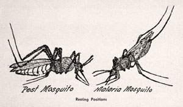
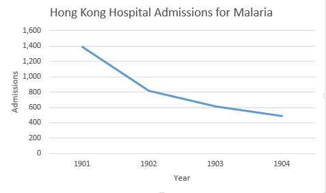
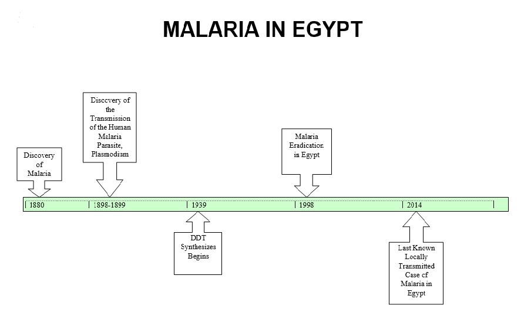

Source: [North Carolina Sanitary Engineering Division. 1955. Mosquitoes, and their control](http://digital.ncdcr.gov/cdm/ref/collection/p249901coll22/id/70479)

Disease ran rampant in Egypt during the early 20th century due to a lack of education concerning proper mosquito repellent techniques. Malaria and Yellow Fever were among the greatest threats to human health mainly because citizens refused to believe that mosquitos could not only spread disease, but also cause it. At this time the Yellow Fever epidemic was coming to an end in America, however Malaria in Egypt was barely being addressed, much less eradicated.

In order to create a better understanding of mosquito control efforts in 1905-1906, I have written an XPath Query that has searched the *Egyptian Gazette* Newspaper Catalogue throughout 1905 and 1906. The XPath Query `//div[@type="section"]/div/p[contains(., 'mosquitoes')]` returned approximately 22 results, of which only 3 were vital to this analysis project. Many queries require a ‘Where’ component, but since mosquitoes were barely spoken of in these issues, if I were to include a specific section or page for XPath to look for, my results would have amounted to zero. To introduce mosquito/disease prophylaxis, as well as the context in which the yellow fever and malaria epidemic was raging, I have included a quotation taken from a concerned reader who wrote to the editor:

>The mayor has issued a proclamation, approved by the State Board and the United States Public Health Service which requires all citizens to allow no stagnant water on their premises; to screen all cisterns after treating the surface with oil; to place oil in cesspools and privy vaults; to sleep under nets; and to screen doors and windows. The Egyptian Sanitary Department ought to issue similar instructions, for not one in a thousand of the people know how dangerous the mosquito is to health.”

-Issue: 1905-12-11 (Line 1766)

Some have tried to encourage the use of mosquito repellents and nets, and to declare war against the mosquito, however the effects have not been widespread. Cities were prophylaxis were employed had a great decrease in disease outbreaks, but the areas surrounding had an increase in deaths due to disease. “From the Federated Malay States there has been published by Dr. Watson shows that in these towns, whilst the number of deaths has been greatly reduced, increase has taken place in the district around, where no anti-malarial operation were undertaken.”, (Issue: 1905-12-04, Line: 2023).

DichloroDiphenylTrichloroethane or DDT was originally synthesized in 1874, but was not recognized for its insecticidal properties until 1939. Thus while mosquitoes were just beginning to be identified by Egyptians as vectors for disease, Americans were years ahead in their fight against mosquitoes.

More information is needed on this topic, it was extremely difficult to collect data on mosquitoes in Egypt. Most historical data had to be gathered from Centers of Disease Control- Malaria website, while the cultural and social opinion of mosquito born disease was found in the *Egyptian Gazette*. The *Egyptian Gazette* provides raw data that is without contextual information, hence only small parts are useful to this analysis project. Web sites, on the other hand, take information from multiple different sources and provide a more complete historical picture. It is important to denote historical advances in medicine and technology in order to help advance present day medicine. The digitization of historical documents is especially important in developing countries, for these countries did not have the resources to immortalize their data as we in America did. For example, if one Google searches “Malaria in America” a plethora of information, pictures, anecdotes, and other historical documents are presented, but Google searching “Malaria in Egypt” presents the viewer with fewer than 10 websites to collect data from. Digitized versions of smaller countries’ historical works is vital to the public domain for research. The public domain is missing decades of documented societal progression in most of the countries around the world.

## Works Cited
CDC - [Malaria - About Malaria - History](https://www.cdc.gov/malaria/about/history).
