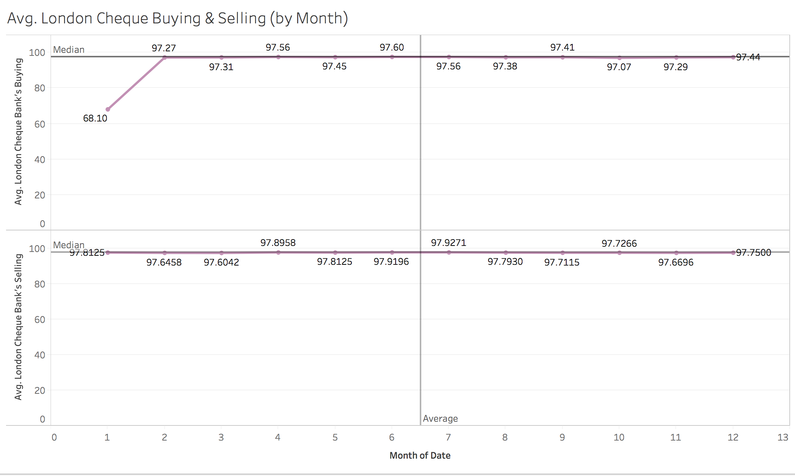
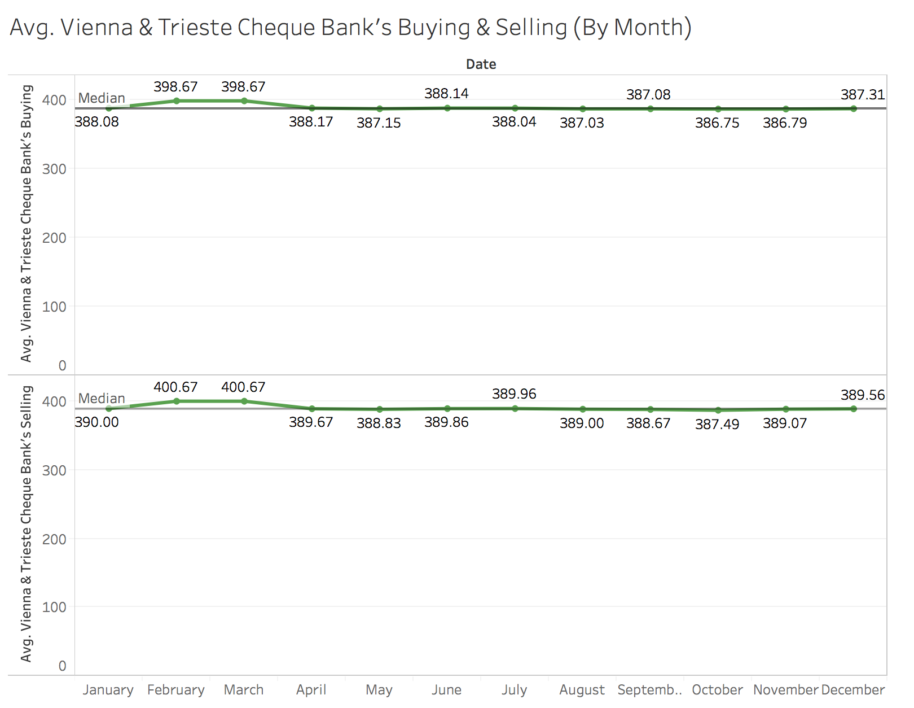

The *Egyptian Gazette* is a typical daily newspaper that not only gives the news that occurs around Egypt, but provides advertisements for local businesses in addition to other stories about what is going on in the world. In this class, we studied several different issues in great detail between the years 1905- 1906, to get a feel for what life was like in Egypt at the turn of the century. There are many different important tables within the paper, which gives information about a variety of topics, ranging from telegram transfer times, to ferry passenger lists, to different stocks - all similar to what can be found today in a modern newspaper. In this class, we conduct a microhistory analysis. Microhistory is defined as an intensive historical investigation of an event, community, or individual. This class and analysis project can easily be defined as "Digital Microhistory", as we spend a lot of time searching and digging through details to come up with an end result to a serial question that isn't outright stated in the *Egyptian Gazette*.

The week that I was assigned to study and analyze was June 25 through June 30, 1906. A lot was happening at the time, including a massacre between townspeople and a British police force commonly referred to in the paper as the 'Denishwai Affair', and almost every issue that I read through and analyzed had some mention of details of the case, trial, and brutal crime that occurred. While most of the issues that were in my week only had six pages, about one-third of them had eight pages - both the Wednesday and Saturday issues. These issues in particular had more pages as they included more advertisements for local businesses than the typical issue, along with more news stories and typically, financial tables.

In my analysis specifically, I focused on a table that occurred in many, not all, of the issues of the Egyptian Gazette called "To-day's Exchange Quotations." This was essentially a table that showed the exchange rates between Egyptian currency with several countries from Europe, including Switzerland and Germany, in addition to several major European cities such as London, Paris, and Vienna. My main goal of this analysis was to see if there was a difference between exchange rates during different times of the year, or if any events such as the Denishwai Affair affected these rates. It gives the impression that there were many travelers from these countries included in the table. This table was most likely useful to visitors of Egypt who need to convert their money from one nation's currency to the next.

I started my analysis with an XPath Query, `//div[@xml:id="deg-el-tdeq01"]//table//row[2]//cell//measure`, which yielded the results of exhange rates for the "London Cheque". In order to find all results, I had to repeat this query, but change the number of the row that the Oxygen XML Editor was searching within amongst the many issues. There were a total of twelve rows, so there were 12 individual Xpath queries that I had to conduct. There were 176 total results from each Xpath Query. The easiest way for me to record the values given to me as a result of the query was to copy the values of exchange into a spreadsheet on excel. When analyzing the results of my query, I saw that many of the values hadn't changed much at all over the span of two years, from 1905-1906. This leaves me with an impression that the currency in Europe, as well as Egypt, was pretty strong and stable at the turn of the 20th century.

In the table "To-day's Exchange Quotations", there are many different rows of information. These included both banks's buying and selling rates for London Cheque (3m. bank and house paper), Paris Cheque (3m. bank and house paper), Switzerland 3m. bank paper, Germany Cheque (3m. bank paper), Italian Cheque, Vienna and Trieste Cheque, and Constantinople cheque. The exchange rates differ considerable from country to country, due to different value of each currency. Based on my research and analysis, the stronger one currency is in comparison to another, it takes less to purchase another currency, and vice versa. The two most expensive currencies were the Germany Cheque and Switzerland Cheque, as they both sold and could be purchased for about 475 Egyptian pounds. The most similar to the Egyptian currency was that of the London Cheque, as the average buying and selling price was 96 2/5, and 97 57/73 respectively. I also needed to discover what exactly the difference was between "house paper" and "bank paper", as some of the listed currencies above had these distinguished variations. I found that "bank paper" is similar to what is nowadays called "commercial paper", which is involved more in investments and credit. "House paper" most likely was just cash or everyday spending money that the Egyptian people had at the time.

For the visualization part of this project, my original idea was to use the Tableau program to create a map, and on the different cities or countries whose currencies are included in the "To-day's Exchange Quotations" table I would place a corresponding symbol, probably a dollar sign, on each of these cities. The more value that country's currency held, the larger the dollar sign or other symbol. I eventually decided to create a line graph, as I personally felt that it would be the easiest way to decipher the information provided. Most financial graphs presented today are in the form of a line graph, so it seemed fairly logical. I made three different graphs, one for London Cheque, one for Paris Cheque, and one for Vienna & Trieste Cheque. Each graph had their own color, to make sure that it was easy to distinguish one graph from another. Within each category of Cheque (London, Paris, and Vienna & Trieste), there was a graph for both the buying and selling counterparts.

Once the graph rendered in the Tableau editing program, it was very clear to see that most of the values of exchange quotations for the different currencies remained relatively steady month after month over the years I studied. Each issue that has been analyzed that contained one of these tables is included in the final analysis. I included a bar on the graph for each currency that includes the median of the data, along with the upper and lower quartiles. The lines were almost completely straight, as the average from month to month remained relatively at the same value. For example, for Paris Cheque Buying rates, the lowest point of value was 386.167, while the highest was 388.563. There was only a 2-point difference between the peak and the trough of the data over a span of almost two full years. The median of Paris Cheque was 387.197. On the other hand, in both London Cheque and Vienna & Trieste Cheque, there were some fluctuations in the line on the graph, despite the majority of the line remaining a relatively flat line.

I was faced with some limitations, however, within my analysis. Some portions of the "To-day's Exchange Quotations" chart had dashes (-) or double dashes (--) to indicate that there were no recorded values for that particular currency on that particular day. Another possible reason that my results showed dashes or double dashes in some spots where numerical values should go is illegibility of the microfilm scan of the Egyptian Gazette. If somebody performed a microfilm scan poorly, and then was unable to utilize OCR with AABBY FineReader to scan the .jpeg image, then it is likely that when the original analyst of a specific issue of the Egyptian Gazette would not have been able to translate what the image said into XML text. I eventually removed the outliers or null data in order to have the most accurate, precise data featured in my data visualization.

All in all, I believe that my analysis is important to see how much purchasing power different currencies had at the turn of the twentieth century. It shows how much European influence that was present in Egypt during these years. This shows to me that there were many travelers at this time, enough at least that a table of the exchange rates of the currencies were included in the local paper. My main goal was to see if there were any changes in value of currency based on time of year or based on different events happening in the world around the time of the analysis, but no correlation was found between either of those factors and the value of the currencies. This doesn't mean that the analysis was a failure at all, of course; conversely, it means that my hypothesis was incorrect and we learned something different about the financial climate in Europe at the turn of the 20th century. I really enjoyed conducting this analysis, and though it was a lot of work, I found that in the end the work is very rewarding. It is very interesting to see that with the technology available today, we can find out a lot about Egypt from over a century ago.

I have attached the [actual Tableau Workbook file](pearce-London-Cheque.twb) for each graph.
