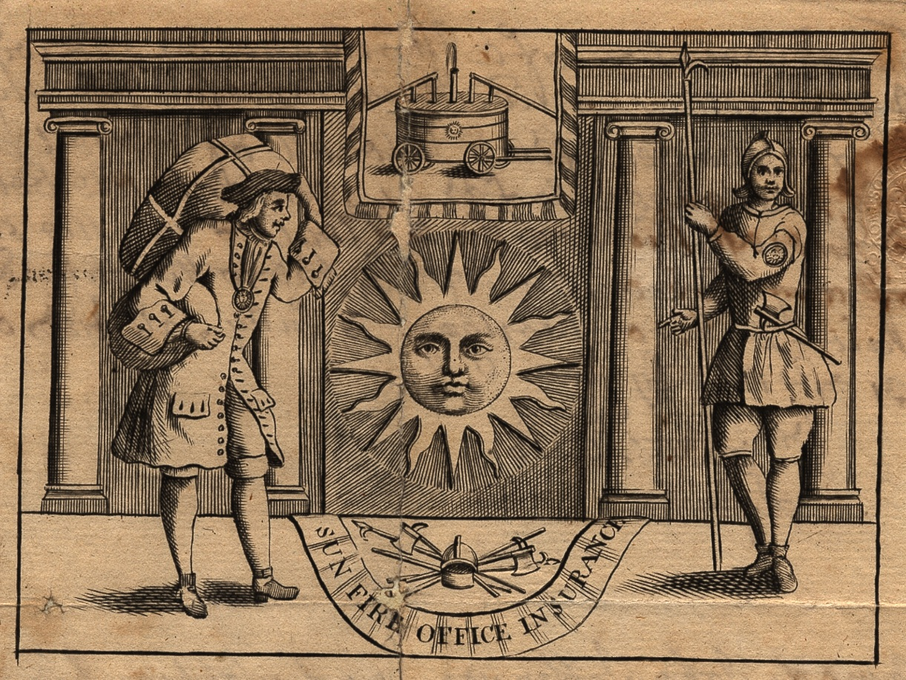
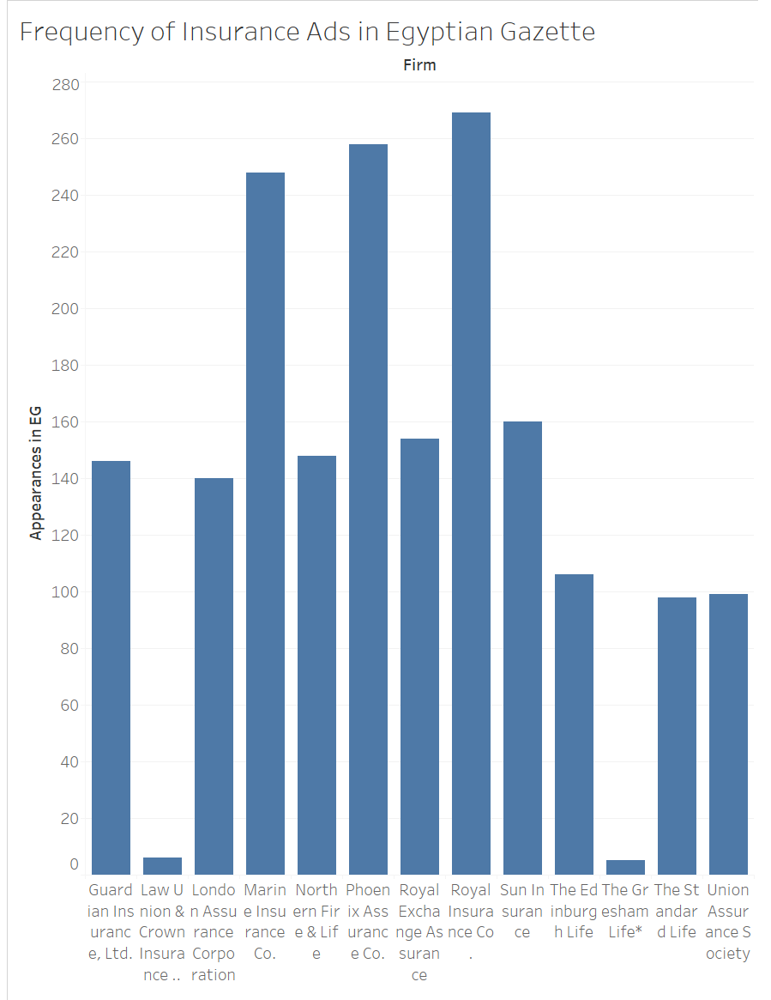
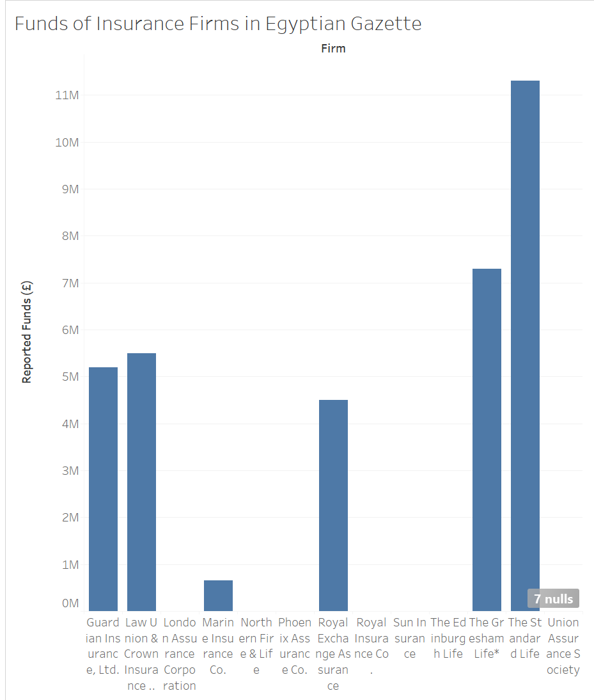

As an undergraduate studying actuarial science, I will be spending ample time learning about insurance and risk management  in the future, from practicing financial mathematics to understanding sound business procedure. So I decided to undertake  my analysis project with a focus towards learning more about insurance in the context of the _Egyptian Gazette_  newspaper. Most of my research was done by using the XPath search functions and reading some online media. In this  report I will discuss what my findings were, my research process and analysis, and some ways to continue this study  given what information I have now.

#### Insurance vs Assurance

One of the first things I noticed while scanning the newspaper for insurance ads was that there were a  handful of ads for assurance firms as well. From what I understand, assurance is just another form of insurance.  The rates, policies and procedures are different, yes, but they serve the same purpose. In fact, many insurance  ad blocks advertise both forms by placing two firms of different specialties in one block. For example, the Royal Insurance  Company is almost always grouped with the Phoenix Assurance Company in their ad block. I suspect the firms cooperated  or are affiliated in some way to occupy that space.

I do not see much difference between the two forms of insurance to warrant excluding one form from my analysis.  In the future, extensive analysis of insurance or assurance alone might make for more discussion of this topic.

#### Insurance Firms and Their Specialties

I started my analysis by using XPath to search for every insurance and assurance firm mentioned in the newspaper within  the number of issues available to me. Here are some of the core searches that yielded the most results:

- `//div[@type="page"][@n="1"]//head[contains(.,"Insurance")]`
- `//div[@type="page"][@n="1"]//head[contains(.,"INSURANCE")]`
- `//div[@type="page"][@n="3"]//p[contains(.,"insurance")]`

To summarize this approach, I browsed every paragraph (p) and header (head) for the variations of the words "insurance" and  "assurance". The vast majority of results came from the first two pages of any issue, in the form of advertisements.

Searching anywhere else brought mixed results: mentions of insurance within headers were rare outside pages 1-2; searching  within paragraphs, however, brought some success. These results came in the form of articles. While some firms were  mentioned in the articles, I ultimately decided to narrow my focus to advertisements, as the articles' information  regarding firms was not sufficient for the type of analysis I wanted to undergo.

Here are all of the insurance and assurance firms I found, their specialties, and their founding dates.

There is a relatively even distribution of fire, life, and marine insurance firms, as well as combinations of the three.  A handful of these firms are grouped together in the newspaper. Such pairs include Edinburgh Life and Society of Canton, and  Royal Insurance and Phoenix Assurance. The number of different firms is smalller than expected, but they appear quite often  the newspaper. Based on my searching, a moderate percentage of these firms make daily appearances in the newspaper issues for some time.

The prevalence of these forms of insurance may be explained with historical perspective. Egypt in 1905-1906 is a colony under  Britain, and Britain brought to Egypt its forms of trade and business. Britain having port cities is an explanation for the  presence of marine insurance in the newspaper, for example. Most if not all of these firms are founded in London or  Europe at the least, and it seems most of them had spread their business practices.

####A Closer Look at Some Insurance Firms

The [1921 Insurance Almanac](https://play.google.com/store/books/details?id=mDVOAQAAMAAJ) by The Underwriter Printing and Publishing Co. provides descriptions of multiple  insurance firms found in the _Egyptian Gazette_.

##### Sun Insurance Office  
> "The Sun Insurance Office is the oldest insurance company in the world, having been organized in 1710. It was known as the Sun Fire Office until 1891, when by act of Parliament its present title was assumed and the company received authority to transact all kinds of insurance. The resources and operations of the Sun are very extensive; it covers a great variety of risks and has agencies in all parts of the world."

So about a decade after the time frame of this analysis, The Sun Insurance Office became a strong force in the market,  with assets in the quarter billions. Sun Insurance was one of the more prevalent ads in the _Gazette_ at this time as well.

##### Phoenix Assurance Company, Limited
>"The Phoenix is one of the largest and most widely operated Fire Insurance companies in the world. Its assets approximate $95,451,688; its surplus and special funds $11,584,565. The reputation of the company is of the best in all respects; its strength is most impressive, its respect for its obligations is traditional, and its operations have been attended with exceptional profit. Admitted to the United States in 1804, it was the first English fire insurance company to establish an American agency plant."

Phoenix Assurance was one of the most common insurance ads in the _Gazette_.

Something else to note from the _Insurance Almanac_ is that many firms in the _Gazette_ have specialties beyond  fire, life, and marine. Sun Insurance also specialized in auto, tornado, and explosion insurance. Phoenix Assurance  covered for riots and civil commotion as well as sprinkler leakage.

#### Data Visualizations

Insurance firms in the _Gazette_ were rated highly in the _Insurance Almanac_. So I endeavored to find out if there  was a correlation between an insurance firm's success and its prevalence in the newspaper, but not all thirteen firms were  in the the almanac, unfortunately. A handful of firms mention their funds in their ads, though, so that would be my second  parameter, and a more objective one at that.

Here are the numbers of times a firm's advertisement appeared in the _Gazette_, using XPath to count the number of valid targets:

Here are the **reported** funds of firms in the _Gazette_, taken from the insurance ads (non-reporting firms' values are left blank):

  
*Gresham Life's funds were converted from euros to pounds*

Unfortunately, half of the firms in the _Gazette_ do not mention their funds in their ads, making the data very incomplete,  but not useless. There is enough data to come to the conclusion that a relation between a firm's prevalence in the newspaper  and its funds is non-existent. Guardian Insurance and Law Union & Crown have a similar number of funds but one shows up  nearly 150 times while the other, under ten. Another example: Gresham Life has the second-highest funds out of the thirteen, but only appears seven times in the _Gazette_. And there are more.

So there are some other reasons as to why a firm appears as often as it does unrelated to the success of the firm. It may be  that the reason has more to do with the newspaper than the insurance firms.

#### Final Thoughts and Continuation of The Study

I was left dissatisfied with how my results turned out. My decision to focus my research and data through the advertisements  may have been a reason why the results turned out as they did, but not having enough time to fully develop my findings,  I feel, is a more comprehensive reason. Deeper and more substantial analysis of this topic requires a better understanding  of history and finance, something I cannot afford to acquire at this moment.

There are some other directions of study that can be taken with regards to insurance in the _Gazette_ that may lead to  more substantial analysis projects.

##### XPath and The Historical Context

It is safe to say that there may be more about the insurance firms to be found in the newspaper apart from in advertisements,  and the key to finding that information lies in the _Gazette_'s articles. I had some success searching for key words  such as "fire," or "disaster" in paragraphs using XPath. And the fact that the majority of insurance firms in the _Gazette_ specialize in fire insurance is no coincidence. With a deeper understanding of Egypt's history through secondary sourcesor personal knowledge, the context behind the ads and articles can be better understood.  (P.G.M. Dickinson's _The Sun Insurance Office, 1710-1960: The History of Two and a Half Centuries of British Insurance._ is a good place to start.)

##### The Financial Context

I originally intended to include analysis of insurance firms in financial tables in the _Gazette_, until I could not find any: searching table cells for insurance firms proved fruitless. I admit my knowledge of XPath and finance is limited, but there must be _something_ of worth to find in that  newspaper, if not, perhaps through secondary sources. The Reuter's Telegrams  and Share List tables may be the best chances at finding potentially useful information in relation to insurance.

##### Faulty XPath Results and Limited Issues

While effectively using XPath searches proved difficult, a part of the difficulty came from sifting through incomplete issues or  incorrect coding, which would always skew the results of XPath searches. The pool of information in these issues is always  changing as additional issues are completed and archived as well. The imperfections of the analysis and coding are to  be expected, as this is an undergraduate level course. Perhaps with time and additional data from the _Egyptian Gazette_,  projects of this form can yield more substantial results.
